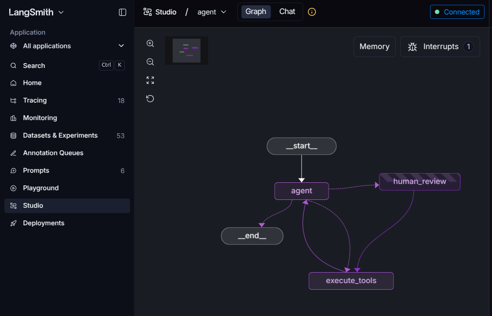
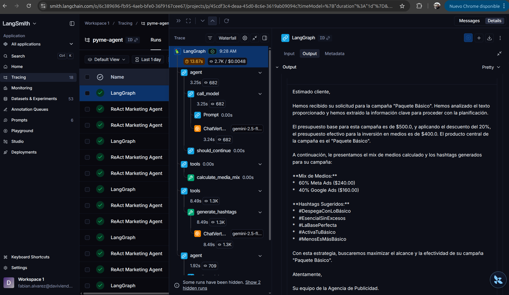

# Arquitectura Avanzada de Agentes de IA: Caso "Calzados La Sabana S.A.S."

Este repositorio contiene la demostración técnica del caso de uso "Calzados de Cuero La Sabana S.A.S.", una PYME bogotana. El objetivo es ilustrar de manera práctica y auditable cómo se construye un sistema autónomo real, alejándonos del concepto de "caja negra" y entrando al detalle del código de implementación.

---

## Tabla de Contenido

1. [El Reto de Negocio: Un "Empleado Digital" para Cualquier PYME](#1-el-reto-de-negocio-un-empleado-digital-para-cualquier-pyme)
2. [El Marco Teórico: Los 7 Pilares de la IA Agéntica](#2-el-marco-teórico-los-7-pilares-de-la-ia-agéntica)
3. [La Metodología: Stack Tecnológico y Construcción](#3-la-metodología-stack-tecnológico-y-construcción)
4. [Del Concepto al Código: Implementación en Calzados La Sabana](#4-del-concepto-al-código-implementación-en-calzados-la-sabana)
5. [Guía Rápida de Despliegue](#5-guía-rápida-de-despliegue)

---

## 1. El Reto de Negocio: Un "Empleado Digital" para Cualquier PYME

Antes de profundizar en la arquitectura y el código, es fundamental entender qué problema de negocio estamos resolviendo. Aunque este repositorio está configurado específicamente para una fábrica de calzado, el potencial de este sistema es transversal a cualquier industria.

**El Reto Universal:** Toda pequeña y mediana empresa sufre del mismo cuello de botella operativo. Dueños y equipos pequeños pierden horas en tareas repetitivas y fragmentadas: cruzar tablas de inventario, calcular presupuestos manuales, redactar correos o campañas repetitivas y coordinar tareas con proveedores externos.

**La Solución (El Producto):** Hemos construido un "Sistema Operativo Agéntico" donde el humano actúa estrictamente como director y la IA como un Ejecutivo Operativo Autónomo. El objetivo es que, con una simple orden en lenguaje natural (ej. *"Lanza la campaña del mes"*), el agente pueda orquestar un flujo multidisciplinario de principio a fin. 

En nuestra demostración, el agente será capaz de:
*   **Analizar la realidad:** Leer la base de datos de la empresa para encontrar qué producto necesita rotación urgente.
*   **Respetar la identidad corporativa:** Redactar contenido basándose en un archivo de memoria que le exige un tono de voz específico (por ejemplo, orgullo nacional, sin anglicismos).
*   **Cuidar la rentabilidad:** Calcular matemáticas financieras y presupuestos. Si intenta ejecutar una acción que genera pérdidas o viola reglas, el sistema interno lo rechaza y la IA se corrige a sí misma.
*   **Delegar el trabajo:** Tras pedir una aprobación de seguridad al humano, el agente subcontrata a otra Inteligencia Artificial (una agencia de publicidad externa) para que ejecute la pauta.

**La Escalabilidad Real:** El código de este repositorio es 100% agnóstico. Simplemente cambiando el archivo local de memoria y apuntando el servidor de datos a otra fuente, este mismo código se transforma instantáneamente en un analista de seguros, un coordinador logístico o un gestor de atención al paciente, demostrando que el desarrollo de agentes es la nueva frontera del software empresarial.

> *Para construir este empleado digital de forma robusta y no como un simple script frágil, necesitamos apoyarnos en la teoría moderna de sistemas autónomos.*

---

## 2. El Marco Teórico: Los 7 Pilares de la IA Agéntica

Para entender cómo funciona nuestro sistema en el fondo, primero debemos definir el hilo conductor conceptual que separa a un simple chatbot conversacional de un agente verdaderamente autónomo. Estos son los 7 pilares sobre los que construimos:

1. **Fundamentos (Agentes Racionales):** Un agente deja de ser un oráculo pasivo de preguntas y respuestas; se convierte en una entidad capaz de percibir cualquier entorno y ejecutar secuencias de acciones con autonomía para maximizar una métrica de éxito.
2. **El Cerebro (Razonamiento Sys2):** El Modelo de Lenguaje (LLM) asume el rol de motor lógico (CPU), utilizando bucles deliberativos (como ReAct: Pensar, Actuar, Observar) para planificar y resolver problemas complejos paso a paso antes de dar una respuesta.
3. **Sistemas de Memoria:** La capacidad arquitectónica de retener información dinámica en el corto plazo (ventana de contexto o memoria de trabajo) y recuperar conocimiento estructurado en el largo plazo (memoria episódica) para evolucionar y mantener coherencia.
4. **Grounding y Herramientas (Tool Calling):** El mecanismo que otorga "manos y ojos" al agente, anclándolo a la realidad al permitirle interactuar universal y estandarizadamente (ej. mediante el Model Context Protocol) con una infinidad de integraciones: APIs, bases de datos o navegadores web.
5. **Reflexión y Autocorrección:** El bucle continuo de "Generar-Criticar-Corregir" que dota al agente de resiliencia, permitiéndole identificar excepciones del entorno o errores lógicos en tiempo real y recalcular su estrategia sin requerir ayuda humana.
6. **Orquestación Multi-Agente:** El diseño donde la complejidad se divide entre múltiples modelos especializados que colaboran mediante topologías de red (grafos, jerarquías) o se comunican de forma descentralizada a través de protocolos abiertos (Agent-to-Agent).
7. **Evaluación y Producción (Guardrails):** Las estrategias críticas para operar en el mundo real: mecanismos de seguridad perimetral (Human-in-the-loop) para pausas obligatorias, observabilidad profunda de cada "pensamiento", y el uso de otros LLMs como jueces evaluadores para medir el desempeño no-determinista.

> *Con la teoría clara, el siguiente paso es elegir las herramientas adecuadas del ecosistema actual de desarrollo para materializar estos pilares en software funcional.*

---

## 3. La Metodología: Arquitectura y Stack Tecnológico

Antes de ver la implementación específica, es vital entender las herramientas que usamos y el ciclo de vida general para construir un ecosistema agéntico desde cero.

### El Stack Tecnológico Base
*   **Orquestación:** LangGraph (para manejar la gestión de estado, los grafos de enrutamiento cíclico y la persistencia).
*   **Modelos y Abstracción:** LangChain como framework integrador y un Modelo de Lenguaje Fundacional (ej. Gemini, GPT, Claude) como el motor cognitivo.
*   **Protocolos Estándar:** MCP (Model Context Protocol) para empaquetar bases de datos y lógica de negocio en servidores seguros y aislados.
*   **Observabilidad:** LangSmith para la telemetría y el rastreo (tracing) de cada ejecución.
*   **Gestión de Dependencias:** uv para un empaquetado extremadamente rápido en Python.

### Visión General del Proceso (El Ciclo de Vida del Agente)
Para desarrollar una arquitectura multi-agente de nivel empresarial, la metodología sigue este ciclo estructurado, que detallaremos a nivel de código en la siguiente sección:

1.  **Definir el Estado (State):** Crear la estructura de memoria que viajará entre los pasos del agente.
2.  **Conectar el Conocimiento (Herramientas/Tools):** Exponer funciones seguras (APIs, bases de datos) al agente.
3.  **Configurar el Cerebro (Modelo y Prompt):** Instanciar el LLM, inyectar las reglas de negocio (System Prompt) y entregarle las herramientas.
4.  **Crear los Nodos de Acción (Físicos):** Definir quién y cómo ejecuta físicamente las decisiones del cerebro.
5.  **Programar el Enrutamiento (ReAct):** Establecer la lógica condicional de qué hacer después de que el cerebro piensa.
6.  **Ensamblar el Grafo (Edges):** Unir todos los nodos en un flujo de trabajo (Workflow) y compilarlo con reglas de seguridad.
7.  **Evaluar (Pruebas Automatizadas):** Validar el comportamiento no determinista usando otros LLMs como jueces.

---

## 4. Guía Paso a Paso: Construyendo el Agente desde el Código

A continuación, mostramos cómo los 7 pasos descritos en la metodología se implementan exactamente en el código fuente de Calzados La Sabana. El objetivo es que sirva como una guía para construir un agente siguiendo nuestro código base.

### Paso 1: Definir el Estado (State) y la Configuración
*   **Qué es:** El "Estado" es la memoria compartida que viaja a través del grafo. Cada nodo lee este estado y devuelve actualizaciones sobre el mismo.
*   **Implementación:** En `src/agent/state.py` definimos `AgentState` heredando de `MessagesState` (nativo de LangGraph para guardar el historial de chat de forma automática) y agregamos variables extra.

```python
# Extracto de src/agent/state.py
from langgraph.graph import MessagesState
from typing import Optional

class AgentState(MessagesState):
    """Estado central para el Agente de Campañas."""
    # human_approved se usa para controlar la pausa de seguridad (Guardrail)
    human_approved: Optional[bool] 
```

### Paso 2: Crear y Conectar las Herramientas (Grounding)
*   **Qué es:** Dotar al agente de "manos" para que pueda interactuar con el entorno real. Antes de poder usarlas, debemos crearlas y exponerlas.
*   **Implementación:** 
    1. **Creación de Herramientas Remotas (MCP):** En `src/mcp_server.py`, usamos el decorador `@mcp.tool()` para encapsular de forma segura la lógica de negocio (como el acceso a `pyme.db`) en un servidor totalmente aislado.
    2. **Creación de Herramientas Locales:** Definimos funciones Python directamente en el código del agente decoradas con `@tool` (ej. `send_to_agency` para la comunicación A2A con otros agentes).
    3. **Conexión y Descubrimiento:** En `src/agent/graph.py`, el agente se conecta dinámicamente al servidor MCP, solicita la lista de herramientas remotas disponibles y las une con sus herramientas locales.

**1. Creación de las Herramientas**
```python
# Herramienta Remota (Extracto de src/mcp_server.py)
@mcp.tool()
def calculate_budget(product_name: str, discount_percentage: float) -> str:
    """Calcula el presupuesto. Retorna feedback textual si viola política corporativa."""
    if discount_percentage > 20:
        # Retornar un error descriptivo en lugar de romper el código dispara el mecanismo de Reflexión del Agente.
        return (
            "Error de política corporativa: El descuento máximo permitido es del 20%. "
            f"Un descuento del {discount_percentage}% genera un margen negativo inaceptable para '{product_name}'. "
            "Reflexiona sobre tu estrategia y vuelve a llamar a la herramienta con un descuento válido."
        )
    
    # Lógica simplificada de presupuesto
    return json.dumps({
        "status": "success", 
        "approved_budget": 500.0 + ((20 - discount_percentage) * 10)
    })

# Herramienta Local (Extracto de src/agent/graph.py)
@tool
async def send_to_agency(product: str, text: str, discount: float, budget: float, config: RunnableConfig) -> str:
    """Envía la campaña vía protocolo A2A al agente de la agencia externa."""
    client = await ClientFactory.connect(
        agent=configurable.a2a_agent_url,
        client_config=ClientConfig(streaming=True, httpx_client=httpx.AsyncClient(timeout=60.0)),
    )
    message = create_text_message_object(content=f"Campaña: {product}...")
    async for event in client.send_message(message):
        # Escucha y guarda los eventos/respuestas del agente remoto
        pass 
        
    return "Campaña enviada exitosamente."
```

**2. Conexión y Descubrimiento desde el Agente**
```python
# Extracto de src/agent/graph.py
async def get_all_tools(config: RunnableConfig):
    """Obtiene dinámicamente las herramientas expuestas por el Servidor MCP y las une a las locales."""
    url = configurable.mcp_server_url
    
    # Se conecta al servidor backend aislado MCP usando SSE
    client = MultiServerMCPClient({
        "pyme_backend": { "transport": "sse", "url": url }
    })
    
    # El agente descubre BBDD, preferencias, calculadoras de presupuesto, etc.
    mcp_tools = await client.get_tools() 
    
    # Devuelve el pool completo de herramientas al Cerebro del Agente
    return mcp_tools + [send_to_agency]
```

### Paso 3: El Nodo Cognitivo (Cerebro, Modelos y el System Prompt)
*   **Qué es:** El nodo principal que razona. Instancia el modelo, inyecta las instrucciones base y vincula las herramientas para que el LLM sepa que existen (`bind_tools`).
*   **Implementación:** En `call_model` (`src/agent/graph.py`), revisamos si ya existe un `SystemMessage` en el estado. Si no, **establecemos e inyectamos el prompt** (con el SOP o Procedimiento Operativo Estándar) al inicio de la lista de mensajes antes de invocar al modelo.

```python
# Extracto de src/agent/graph.py
async def call_model(state: AgentState, config: RunnableConfig):
    # 1. Configurar el Modelo
    llm = ChatVertexAI(model_name="gemini-1.5-pro", temperature=0.0)
    
    # 2. Vincular las herramientas disponibles
    all_tools = await get_all_tools(config)
    llm_with_tools = llm.bind_tools(all_tools)
    
    # 3. Establecer e inyectar el System Prompt
    messages = state.get("messages", [])
    if not any(isinstance(m, SystemMessage) for m in messages):
        sys_msg = SystemMessage(content=(
            "Eres el agente inteligente y autónomo de Calzados La Sabana S.A.S.\n"
            "DEBES ejecutar proactivamente el siguiente SOP:\n"
            "Paso 1: Obtén las preferencias del gerente.\n"
            "Paso 2: Lee la BBDD y escoge el producto estratégico.\n"
            "Paso 3: Calcula presupuesto. Si fallas por políticas, corrige tu error.\n"
            "Paso 4: Redacta el texto de campaña.\n"
            "Paso 5: Envía la campaña a la agencia externa."
        ))
        # Inyectamos el prompt al inicio de la conversación
        messages = [sys_msg] + messages 
    
    # 4. Invocar al modelo con el estado actualizado
    response = await llm_with_tools.ainvoke(messages)
    return {"messages": [response]} # LangGraph agregará este mensaje al estado
```

### Paso 4: Crear los Nodos Físicos de Acción y Pausa
*   **Qué es:** Nodos que no "piensan", solo ejecutan mecánicamente las decisiones del LLM o detienen el flujo.
*   **Implementación:** Usamos `ToolNode` (una utilidad preconstruida de LangGraph) para ejecutar las herramientas, y un nodo manual de pausa de seguridad.

```python
# Extracto de src/agent/graph.py
async def call_tools(state: AgentState, config: RunnableConfig):
    """Nodo físico que ejecuta la herramienta pedida por el LLM."""
    all_tools = await get_all_tools(config)
    tool_node = ToolNode(all_tools)
    result = await tool_node.ainvoke(state, config)
    return {"messages": result["messages"]}

async def human_review(state: AgentState, config: RunnableConfig):
    """Nodo de pausa (Guardrail) para requerir revisión humana."""
    return {"human_approved": None}
```

### Paso 5: Programar el Enrutamiento Lógico (Bucle ReAct)
*   **Qué es:** Tras cada salida del "Cerebro", necesitamos un enrutador condicional (Edge) que decida qué ruta tomar.
*   **Implementación:** Leemos el último mensaje generado por el LLM en el estado y observamos su atributo `tool_calls`.

```python
# Extracto de src/agent/graph.py
def route_after_model(state: AgentState) -> Literal["human_review", "execute_tools", "__end__"]:
    last_message = state["messages"][-1]
    
    # Caso 1: Si no pidió usar herramientas, el agente terminó
    if not last_message.tool_calls:
        return "__end__"
    
    # Caso 2: Si quiere gastar dinero (send_to_agency), fuerza revisión humana
    for tc in last_message.tool_calls:
        if tc["name"] == "send_to_agency":
            return "human_review"
            
    # Caso 3: Para consultar datos internos, ejecutar directamente
    return "execute_tools"
```

### Paso 6: Ensamblar y Compilar el Grafo (Edges y Guardrails)
*   **Qué es:** Juntar todas las piezas (nodos) creadas anteriormente y trazar las rutas (Edges) entre ellos para formar el flujo de trabajo final.
*   **Implementación:** En `src/agent/graph.py` declaramos un `StateGraph`, añadimos los nodos y configuramos los enlaces (saltos incondicionales y condicionales).

```python
# Extracto de src/agent/graph.py
builder = StateGraph(AgentState, config_schema=Configuration)

# 1. Agregar Nodos al Grafo
builder.add_node("agent", call_model) # El Cerebro
builder.add_node("human_review", human_review) # La Pausa
builder.add_node("execute_tools", call_tools) # La Acción física

# 2. Conectar las aristas (Edges)
builder.add_edge(START, "agent") # Inicio
builder.add_conditional_edges("agent", route_after_model) # Enrutador dinámico (Paso 5)
builder.add_edge("human_review", "execute_tools") # Tras aprobar, ejecuta
builder.add_edge("execute_tools", "agent") # Bucle (ReAct): vuelve a pensar tras actuar

# 3. Compilar el grafo inyectando seguridad en tiempo de ejecución
graph = builder.compile(
    interrupt_before=["human_review"], # Se detiene EXACTAMENTE antes de este nodo
    name="ReAct Marketing Agent",
)
```

> *(Nota para el presentador: Al correr `langgraph dev`, el `interrupt_before` detendrá el flujo y el grafo se visualizará así)*
> 

### Paso 7: Evaluación y Control de Calidad (LLM-as-a-judge)
*   **Qué es:** Dado que el agente genera respuestas no predecibles (estocásticas), debemos usar un modelo evaluador para hacer pruebas unitarias o de calidad (QA).
*   **Implementación:** En `tests/test_accuracy_llm_as_judge.py`, utilizamos otro LLM estricto como "juez" para asegurar que el agente aplicó el descuento y respetó el tono de voz en su output final.

```python
# Extracto de tests/test_accuracy_llm_as_judge.py
PROMPT_LLM_AS_JUDGE = """
Eres un juez experto evaluando a un Agente de Inteligencia Artificial.
Salida del agente: {output}

Evalúa si el agente cumplió con las restricciones (corrigió descuento a <= 20%, tono bogotano, etc.).
Responde ÚNICAMENTE con un JSON: {"score": <0.0 a 1.0>, "comentario": "<tu explicación>"}
"""
```

> *(Nota para el presentador: Insertar captura del panel de trazas y evaluación de LangSmith)*
> 

---

## 5. Guía Rápida de Despliegue

### Requisitos y Variables de Entorno
Crea un archivo `.env` en la raíz de la carpeta `prototipo_clase` con:
```bash
GOOGLE_CLOUD_PROJECT="tu_proyecto_de_gcp"
GOOGLE_CLOUD_LOCATION="us-central1"
LANGCHAIN_TRACING_V2=true
LANGCHAIN_API_KEY="tu_api_key_de_langsmith"
LANGCHAIN_PROJECT="Pyme Agent Demo"
```

Dado que el agente utiliza `ChatVertexAI` para interactuar con la infraestructura empresarial de Google Cloud, **no se requiere una GOOGLE_API_KEY**. En su lugar, el entorno debe estar autenticado con GCP. Para estudiantes ejecutándolo localmente, deben instalar `gcloud` CLI y ejecutar:

```bash
gcloud auth application-default login
gcloud config set project tu_proyecto_de_gcp
```

### Instalación e Inicialización
Recomendamos usar `uv` para la gestión del proyecto. Instala las dependencias y genera la base de datos de ventas (el script creará `pyme.db` populando productos como botas industriales y zapatos formales):

```bash
# 1. Sincronizar el entorno virtual y dependencias
uv sync

# 2. Inicializar la base de datos local
uv run python setup_db.py
```

### Levantar el Ecosistema
Para correr la demostración completa, necesitas abrir tres terminales independientes en la raíz del proyecto:

**Terminal 1: El Backend Aislado (Servidor MCP)**
```bash
uv run python src/mcp_server.py
```

**Terminal 2: La Agencia de Publicidad (Agente Externo A2A)**
```bash
uv run python src/agency_agent.py
```

**Terminal 3: El Cerebro y UI (LangGraph Studio)**
```bash
langgraph dev
```
